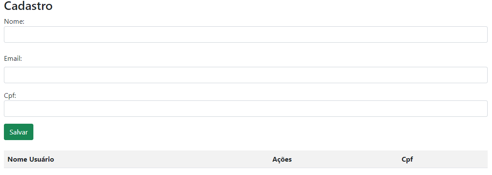

# Cadastro

## Visão geral
Este arquivo HTML é uma página da web simples para registro de usuário. Ele permite que os usuários insiram seus nomes, salvem-nos e exibam uma lista de nomes salvos com opções para editar ou excluir cada entrada. A página utiliza Bootstrap para estilização e inclui funções JavaScript para lidar com interações do usuário.

## Estrutura do arquivo
* Estrutura HTML: O arquivo HTML contém a estrutura básica de uma página da web, incluindo a declaração DOCTYPE e as seções head e body.
* Estilo: a página usa o Bootstrap 5 para estilo, que é incluído por meio de um link CDN na seção principal.
* JavaScript: As funções JavaScript para manipular interações do usuário (como salvar, editar e excluir dados do usuário) são carregadas de um controller.jsarquivo externo.

## Componentes-chave
### Seção principal:
* A headseção inclui meta tags para codificação de caracteres, compatibilidade e configurações de viewport.
* O CSS do Bootstrap está vinculado ao estilo dos elementos do formulário e da tabela.
* O título da página está definido como "Cadastro".

### Seção de formulário:
* Um contêiner div
* O formulário inclui um rótulo e um campo de entrada para o nome do usuário ( id="nomeUser").
* Um botão “Salvar” ( btn btn-success) adiciona o salvarUser()função quando clicar.

### Seção de tabela:
* Outro contêiner div contém uma tabela ( id="tabela").
* A tabela usa classes Bootstrap ( table table-striped).

# Componente de Formulário de Email
 
Este projeto contém um componente de formulário simples, que inclui um campo para inserção de email.
 
## Estrutura do Código
 
O código HTML é composto pelos seguintes elementos:
 
- **Div Container (`mb-3`)**: Um contêiner `<div>` com a classe `mb-3`, que aplica uma margem inferior ao elemento, garantindo espaçamento adequado entre ele e outros elementos no layout.
- **Label (`<label>`)**: Um rótulo associado ao campo de email, utilizando o atributo `for` para ligar ao campo de entrada de email. O texto "Email:" é exibido para indicar o propósito do campo.
- **Campo de Entrada de Email (`<input>`)**: Um campo de entrada do tipo `email`, que valida automaticamente se o valor inserido é um endereço de email válido. Este campo é estilizado com a classe `form-control` do Bootstrap, garantindo uma aparência uniforme e responsiva.

# Formulário de Inserção de CPF

Este projeto fornece um formulário HTML simples para captura do número do CPF (Cadastro de Pessoas Fisícas), que é usado no Brasil para identificar de contribuinte  individual.

## Característica

**Campo de entrada HTML**: Inclui um campo de entrada de texto para úsuario inserir seu código O snippet HTML ara o formulário de entrada do CPF: ```html <label for="cpf">CPF:</label> <div class="mb-3"> <input type="text" class="form-control" name="cpf"> </div>```




# Login

Esta é uma página de login simples para um aplicativo da web, projetada com HTML e Bootstrap. Ela permite que os usuários insiram seu e-mail e senha para fazer login.

## Desenvolvimento
* HTML : Usado para a estrutura do formulário de login e link.
* CSS : Estilos personalizados devem ser adicionados em main.css.
* JavaScript : A lógica para lidar com login deve ser implementada em controller.js.


## Uso
1. Abra index.html em um navegador da web.
2. Digite seu e-mail e senha nos respectivos campos.
3. Clique no botão "ACESSAR" para tentar fazer login.
4. Utilize o link "Cadastre-se" para navegar até a página de inscrição, se necessário.
 
 


## Explicação do Código JavaScript

Função acessar():

````
function acessar() {
    let loginEmail = document.getElementById('loginEmail').value;
    let loginSenha = document.getElementById('loginSenha').value;

    // VERIFICA SE O 'LOGINEMAIL' OU 'LOGINSENHA' ESTÁ VAZIO OU INDEFINIDO
    if (!loginEmail || !loginSenha) {
        alert("Favor preencher todos os campos");
    } else {
        // Se os campos estiverem preenchidos, redireciona para a página de cadastro
        window.location.href = 'cadastro.html';
    }
}
````

Esta função valida se os campos de e-mail e senha foram preenchidos. Se algum dos campos estiver vazio, um alerta é exibido. Se ambos estiverem preenchidos, o usuário é redirecionado para a página de cadastro.

Função salvarUser():

````
var dadoLista = [];
var emailLista = [];
function salvarUser() {
    let nomeUser = document.getElementById('nomeUser').value;
    let emailUser = document.getElementById('emailUser').value;

    // VERIFICA SE O EMAIL ESTÁ VÁLIDO
    if(document.forms[0].emailcad.value == "" || 
    document.forms[0].emailcad.value.indexOf('@') == -1 ||
    document.forms[0].emailcad.value.indexOf('.') == -1){
        alert("Por favor, preencha seu email corretamente");
    }
    else if (nomeUser) {
        dadoLista.push(nomeUser);
        emailLista.push(emailUser);
        criaLista();

        // LIMPA O CAMPO DE ENTRADA
        document.getElementById('nomeUser').value = "";
        document.getElementById('emailUser').value = "";
    }
    else {
        alert("Por favor informe um nome para cadastro");
    }
}
````

Esta função adiciona o nome e o e-mail do usuário às listas dadoLista e emailLista, respectivamente, se o e-mail for válido e o nome for fornecido. Após adicionar os dados, a função criaLista() é chamada para atualizar a tabela. Os campos de entrada são limpos depois que os dados são salvos.

function criaLista():

````
function criaLista() {
    let tabela = document.getElementById('tabela').innerHTML = "<tr><th>Nome Usuário</th><th>Email</th><th>Ações</th</th>";

    for (let i = 0; i <= (dadoLista.length - 1); i++) {
        tabela += "<tr><td>" + dadoLista[i] + "</td><td>" + emailLista[i] + "</td><td><button type= 'button' onclick='editar(parentNode.parentNode.rowIndex)'>Editar</button><button type= 'button' onclick='excluir(parentNode.parentNode.rowIndex)'>Excluir</button></td></tr>";
        document.getElementById('tabela').innerHTML = tabela;
    }
}
````
Esta função atualiza a tabela HTML com os nomes e e-mails armazenados nas listas dadoLista e emailLista. Ela gera as linhas da tabela com botões para editar e excluir cada entrada.

Função editar(i)

````
function editar(i) {
    document.getElementById('nomeUser').value = dadoLista[(i - 1)];
    document.getElementById('emailUser').value = emailLista[(i - 1)];

    dadoLista.splice(dadoLista[(i - 1)], 1);
    emailLista.splice(emailLista[(i - 1)], 1);
}

````
Esta função permite editar uma entrada na tabela. Ela preenche os campos de entrada com os dados da linha selecionada e remove esses dados da lista.

Função excluir(i):

````
function excluir(i) {
    dadoLista.splice((i - 1), 1);
    emailLista.splice((i - 1), 1);
    document.getElementById('tabela').deleteRow(i);
}

````

Esta função exclui uma entrada da tabela e das listas dadoLista e emailLista.

### Autor:
[Nayra Vitória dos Santos](https://github.com/nayravsantos)